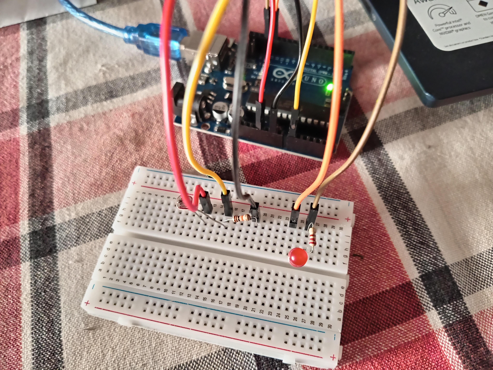

# Arduino LDR Project

## Description
This project uses an LDR (Light Dependent Resistor) to detect light levels and control an LED automatically.

## Components
- Arduino Uno
- LDR Sensor
- LED
- 220Ω Resistor
- 10kΩ Resistor
- Jumper wires
- Breadboard

## Circuit Diagram

## How to Use
1. Upload `LDR.ino` to your Arduino board.
2. Connect the LDR and LED as shown in the diagram.
3. The LED will turn ON/OFF depending on the light level.

## Notes
- Make sure to adjust the threshold value in the code according to your room light.
